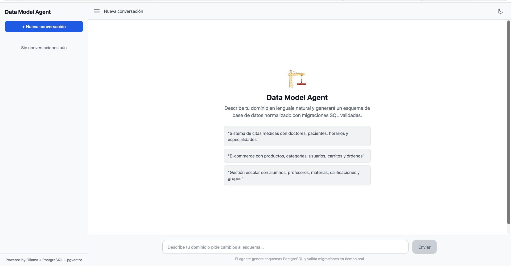

# Data Model Agent: De lenguaje natural a esquemas ejecutables

## Contexto del proyecto



Estoy construyendo un agente especializado para el reto **"Agentes Especializados"**
del **Hackathon Código Facilito x AWS Kiro**. El agente reemplaza el modelado
manual de bases de datos (diagramas arrastrando cajas) por una conversación:
el usuario describe su dominio en lenguaje natural, el agente itera con él,
genera migraciones y las valida ejecutándolas contra una base de datos real
antes de entregarlas.

## Problema que resuelve

El modelado de datos es un cuello de botella real en cualquier proyecto de
software: normalmente lo hace un desarrollador senior de forma manual, y los
errores de normalización o relaciones mal diseñadas terminan convirtiéndose en
migraciones destructivas y refactors costosos.

Las herramientas actuales (dbdiagram.io, MySQL Workbench, ERBuilder, entre
otras) son principalmente visuales y manuales; no son conversacionales ni
autovalidantes.

## Arquitectura técnica


| Componente | Tecnología | Rol |
|------------|------------|-----|
| Frontend | Laravel + Alpine.js + Tailwind | UI conversacional |
| Orchestrator | FastAPI (Python) | Agente + API REST |
| LLM | Ollama (Llama 3.2) | Motor de razonamiento |
| RAG | pgvector + sentence-transformers | Buenas prácticas de BD |
| MCP Tools | Python + SQLAlchemy | Introspección + ejecución |
| Base de datos | PostgreSQL 16 | Almacenamiento + validación |

---

# Docker

Actualmente el frontend también está disponible como imagen pública en Docker Hub.

## Descargar la imagen

```bash
docker pull mocjaim27/data-model-agent-frontend:latest
```

El servicio **Data Model Agent Orchestrator** también está disponible como imagen pública en Docker Hub.

## Descargar la imagen

```bash
docker pull mocjaim27/data-model-agent-orchestrator:latest
```

## Ejecutar

```bash
docker run -p 8080:80 mocjaim27/data-model-agent-frontend:latest
```

```bash
docker run -p 8080:80 mocjaim27/data-model-agent-orchestrator:latest
```

## Docker Hub

https://hub.docker.com/r/mocjaim27/data-model-agent-frontend

---

## Quick Start

### Requisitos

- Docker y Docker Compose
- 8 GB RAM (para el modelo LLM)
- 5 GB disco (modelo + imágenes)

### Levantar el proyecto

```bash
# Clonar el repositorio
git clone https://github.com/tu-usuario/data-model-agent.git
cd data-model-agent

# Copiar configuración
cp .env.example .env

# Setup completo (build + arrancar + descargar modelo)
make setup
```

Esto levanta 4 servicios:

- **Frontend:** http://localhost:8080
- **API Docs:** http://localhost:8000/docs
- **PostgreSQL:** localhost:5432
- **Ollama:** localhost:11434

### Uso básico

1. Abre http://localhost:8080
2. Describe tu dominio:

> "Sistema de citas médicas con doctores, pacientes, horarios y especialidades"

3. El agente generará:

- Explicación de decisiones de diseño.
- Esquema JSON con entidades y relaciones.
- Migraciones SQL ejecutables.
- Badge de validación (✓ ejecutada exitosamente contra una base de datos de prueba).

4. Itera con nuevas instrucciones, por ejemplo:

> "Un doctor puede tener varias especialidades."

---

# ¿Cómo funciona?

## Flujo del agente

```text
1. Usuario describe dominio
   ↓
2. RAG busca buenas prácticas relevantes (pgvector similarity search)
   ↓
3. Se inspecciona el esquema actual (si existe)
   ↓
4. LLM genera esquema + migraciones con contexto enriquecido
   ↓
5. Agent loop: si el LLM invoca tools, se ejecutan y se reenvía el resultado
   ↓
6. La migración se ejecuta contra una base de datos de prueba
   ↓
7. Si falla → el LLM corrige → vuelve a ejecutar
   ↓
8. Respuesta final validada al usuario
```

---

## RAG (Retrieval-Augmented Generation)

La base de conocimiento contiene 24 documentos relacionados con diseño de bases
de datos, entre ellos:

- Patrones de modelado.
- Antipatrones.
- Buenas prácticas para PostgreSQL.
- Recomendaciones para migraciones.

Ejemplos:

- surrogate keys
- timestamps
- tablas pivote
- índices en claves foráneas
- normalización 3NF
- evitar EAV
- evitar CSV columns
- tipos correctos para dinero
- migraciones idempotentes

El agente consulta automáticamente los documentos más relevantes mediante
búsqueda semántica usando pgvector y sentence-transformers.

---

## MCP Tools

| Tool | Función |
|------|----------|
| `inspect_schema` | Devuelve el esquema actual (tablas, columnas, FK e índices) |
| `execute_migration` | Ejecuta SQL y reporta éxito o error |
| `validate_migration` | Valida sintaxis utilizando rollback |
| `reset_database` | Limpia la base de datos de prueba |

---

# Estructura del proyecto

```text
data-model-agent/
├── docker-compose.yml
├── Makefile
├── .env.example
│
├── orchestrator/
│   ├── app/
│   │   ├── api/
│   │   ├── core/
│   │   ├── mcp_tools/
│   │   ├── rag/
│   │   └── services/
│   ├── Dockerfile
│   └── requirements.txt
│
├── frontend/
│   ├── app/
│   ├── resources/
│   ├── routes/
│   └── Dockerfile
│
├── docker/
│   └── postgres/
│       ├── Dockerfile
│       └── init/
│           └── 01-init.sql
│
└── scripts/
    └── verify-e2e.sh
```

---

# Comandos útiles

```bash
make up
make down
make build
make logs
make pull-model
make clean
make restart-orch

./scripts/verify-e2e.sh
```

---

# Deploy en producción

## VPS recomendado

- CPU: 4 cores
- RAM: 8 GB (16 GB recomendado)
- Disco: 20 GB SSD
- Ubuntu 22.04+

### Instalación

```bash
# Instalar Docker
curl -fsSL https://get.docker.com | sh

# Clonar proyecto
git clone https://github.com/tu-usuario/data-model-agent.git

cd data-model-agent

cp .env.example .env

# Configurar variables

docker compose up -d

docker compose exec ollama ollama pull llama3.2

./scripts/verify-e2e.sh
```

---

## HTTPS con Caddy

Agregar al docker-compose:

```yaml
caddy:
  image: caddy:2
  ports:
    - "80:80"
    - "443:443"
  volumes:
    - ./Caddyfile:/etc/caddy/Caddyfile
    - caddy_data:/data
```

Caddyfile:

```text
tudominio.com {
    reverse_proxy frontend:80
}
```

---

# Tecnologías

| Tecnología | Versión | Uso |
|------------|----------|-----|
| Python | 3.11 | Backend |
| FastAPI | 0.115 | API REST |
| SQLAlchemy | 2.0 | ORM |
| Ollama | latest | Inferencia local |
| Llama 3.2 | 3B | LLM |
| sentence-transformers | 3.1 | Embeddings |
| PostgreSQL | 16 | Base de datos |
| pgvector | 0.7+ | Búsqueda semántica |
| Laravel | 12.x | Frontend |
| Alpine.js | 3.x | Reactividad |
| Tailwind CSS | 3.x | Estilos |

---

# Licencia

MIT.

Úsalo, modifícalo y distribúyelo libremente.

---

## Autor

**Jaime Alberto Suárez Moctezuma**

Proyecto desarrollado para el **Hackathon Código Facilito × AWS Kiro**.
