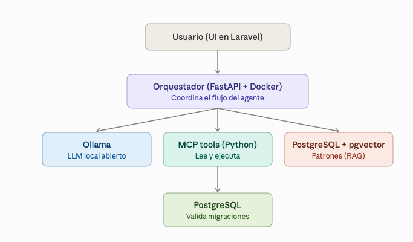

# Data Model Agent: De lenguaje natural a esquemas ejecutables

## Contexto del proyecto
Estoy construyendo un agente especializado para el reto "Agentes Especializados" 
de un hackathon (Código Facilito x AWS Kiro). El agente reemplaza el modelado 
manual de bases de datos (diagramas arrastrando cajas) por una conversación: 
el usuario describe su dominio en lenguaje natural, el agente itera con él, 
genera migraciones, y las valida ejecutándolas contra una base de datos real 
antes de entregarlas.

## Problema que resuelve
El modelado de datos es un cuello de botella real en cualquier proyecto de 
software: normalmente lo hace un dev senior a mano, y los errores de 
normalización o relaciones mal diseñadas se pagan caro después en forma de 
migraciones destructivas y refactors. Las herramientas actuales (dbdiagram.io, 
MySQL Workbench, ERBuilder) son visuales y manuales, no conversacionales ni 
autovalidantes.

## Arquitectura técnica.




| Componente    | Tecnología                       | Rol                         |
| ------------- | -------------------------------- | --------------------------- |
| Frontend      | Laravel + Alpine.js + Tailwind   | UI conversacional           |
| Orchestrator  | FastAPI (Python)                 | Agente + API REST           |
| LLM           | Ollama (Llama 3.2)               | Motor de razonamiento       |
| RAG           | pgvector + sentence-transformers | Buenas prácticas de BD      |
| MCP Tools     | Python + SQLAlchemy              | Introspección + ejecución   |
| Base de datos | PostgreSQL 16                    | Almacenamiento + validación |

## Quick Start

### Requisitos

- Docker y Docker Compose
- 8 GB RAM (para el modelo LLM)
- 5 GB disco (modelo + imágenes)

### Levantar el proyecto

```bash
# Clonar el repositorio
git clone https://github.com/tu-usuario/data-model-agent.git
cd data-model-agent

# Copiar configuración
cp .env.example .env

# Setup completo (build + arrancar + descargar modelo)
make setup
```

Esto levanta 4 servicios:
- **Frontend**: http://localhost:8080
- **API Docs**: http://localhost:8000/docs
- **PostgreSQL**: localhost:5432
- **Ollama**: localhost:11434

### Uso básico

1. Abre http://localhost:8080
2. Describe tu dominio: *"Sistema de citas médicas con doctores, pacientes, horarios y especialidades"*
3. El agente generará:
   - Explicación de decisiones de diseño
   - Esquema JSON con entidades y relaciones
   - Migraciones SQL ejecutables
   - Badge de validación (✓ ejecutada exitosamente contra BD de prueba)
4. Itera: *"un doctor puede tener varias especialidades"*

## ¿Cómo funciona?

### Flujo del agente

```
1. Usuario describe dominio
   ↓
2. RAG busca buenas prácticas relevantes (pgvector similarity search)
   ↓
3. Se inspecciona el esquema actual (si existe)
   ↓
4. LLM genera esquema + migraciones con contexto enriquecido
   ↓
5. Agent loop: si el LLM invoca tools, se ejecutan y reenvía resultado
   ↓
6. Migración se ejecuta contra BD de prueba real
   ↓
7. Si falla → LLM intenta corregir → re-ejecuta
   ↓
8. Respuesta final con validación al usuario
```

### RAG (Retrieval-Augmented Generation)

La base de conocimiento contiene 24 documentos:

- **Patrones**: surrogate keys, timestamps, tablas pivote, índices en FK, normalización 3NF...
- **Anti-patrones**: God Table, EAV, CSV columns, float para dinero...
- **Best practices**: tipos PostgreSQL correctos, migraciones idempotentes...

El agente consulta los más relevantes para cada solicitud usando búsqueda semántica.

### MCP Tools

| Tool                 | Función                                                 |
| -------------------- | ------------------------------------------------------- |
| `inspect_schema`     | Devuelve esquema actual (tablas, columnas, FK, índices) |
| `execute_migration`  | Ejecuta SQL y reporta éxito/error                       |
| `validate_migration` | Valida sintaxis sin persistir (rollback)                |
| `reset_database`     | Limpia BD de prueba para empezar de cero                |

## Estructura del proyecto

```
data-model-agent/
├── docker-compose.yml          # Orquestación de servicios
├── Makefile                    # Comandos útiles
├── .env.example                # Variables de entorno
│
├── orchestrator/               # FastAPI (Python)
│   ├── app/
│   │   ├── api/               # Endpoints REST
│   │   ├── core/              # Config + Database
│   │   ├── mcp_tools/         # Schema introspection + Migration executor
│   │   ├── rag/               # Knowledge base + Engine + Loader
│   │   └── services/          # Ollama client + Agent core
│   ├── Dockerfile
│   └── requirements.txt
│
├── frontend/                   # Laravel
│   ├── app/Http/Controllers/  # ChatController
│   ├── resources/views/chat/  # UI Alpine.js + Tailwind
│   ├── routes/web.php
│   └── Dockerfile
│
├── docker/
│   └── postgres/
│       ├── Dockerfile          # PostgreSQL + pgvector
│       └── init/01-init.sql    # Esquema inicial
│
└── scripts/
    └── verify-e2e.sh          # Verificación de integración
```

## Comandos útiles

```bash
make up          # Levantar servicios
make down        # Detener servicios
make build       # Reconstruir imágenes
make logs        # Ver logs en tiempo real
make pull-model  # Descargar modelo LLM
make clean       # Eliminar todo (incluyendo datos)
make restart-orch # Reiniciar solo el orquestador

# Verificación
./scripts/verify-e2e.sh
```

## Deploy en producción

### VPS mínimo (recomendado)

- **CPU**: 4 cores
- **RAM**: 8 GB (16 GB ideal para modelos más grandes)
- **Disco**: 20 GB SSD
- **SO**: Ubuntu 22.04+

### Pasos

```bash
# 1. Instalar Docker
curl -fsSL https://get.docker.com | sh

# 2. Clonar y configurar
git clone https://github.com/tu-usuario/data-model-agent.git
cd data-model-agent
cp .env.example .env
# Editar .env con valores de producción

# 3. Levantar
docker compose up -d

# 4. Descargar modelo
docker compose exec ollama ollama pull llama3.2

# 5. Verificar
./scripts/verify-e2e.sh
```

### Con HTTPS (Caddy reverse proxy)

Agregar al `docker-compose.yml`:

```yaml
  caddy:
    image: caddy:2
    ports:
      - "80:80"
      - "443:443"
    volumes:
      - ./Caddyfile:/etc/caddy/Caddyfile
      - caddy_data:/data
```

`Caddyfile`:
```
tudominio.com {
    reverse_proxy frontend:80
}
```

## Tecnologías

| Componente            | Versión | Propósito            |
| --------------------- | ------- | -------------------- |
| Python                | 3.11    | Backend orchestrator |
| FastAPI               | 0.115   | API REST async       |
| SQLAlchemy            | 2.0     | ORM async            |
| Ollama                | latest  | LLM inference local  |
| Llama 3.2             | 3B      | Modelo de lenguaje   |
| sentence-transformers | 3.1     | Embeddings para RAG  |
| PostgreSQL            | 16      | Base de datos        |
| pgvector              | 0.7+    | Búsqueda semántica   |
| Laravel               | 12.x    | Frontend web         |
| Alpine.js             | 3.x     | Reactividad frontend |
| Tailwind CSS          | 3.x     | Estilos              |

## Licencia

MIT — úsalo con responsabilidad como tu quieras.

Desarrollado para el **Hackathon Código Facilito x AWS Kiro** 
Jaime Alberto Suarez Moctezuma 
